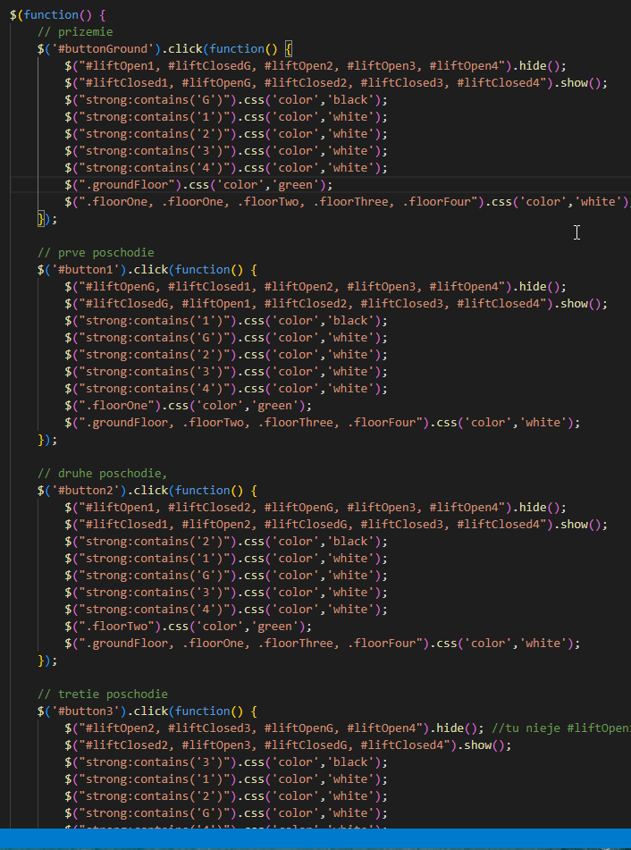

# visma_elevator

This is [Visma.Bootcamp.Assignment](https://github.com/tomas-blanarik/Visma.Bootcamp.Assignment) built by [Jakub Dupej](https://jakubdupej.maweb.eu/).

## SOLUTION

 2 days ago when I have received this Assignment I had 0 experience and knowledge with JavaScript and libraries around it. After intensive 13 hours of learning I have decided that animatiion
 in my case is something I wont do perfectly so I've used principle of ***.show()*** and ***.hide()*** of pictures found on the internet of open and closed elevator, added floor indicator, highlights current floor on the floor using [jQuery](https://jquery.com/), styles in CSS.

### EXAMPLE

 when
 > elevator is on floor = 1
 then
 > opened doors on floor = 1 and closed on floor = G, 2 ,3, 4

 I applied this logic to all of the floors like this at first 

then I realised there should be a better way and picked all **elements** with same **action** when **selector** is **active**  + added a few functions including where is elevator right now and highlighted the floor text as well

